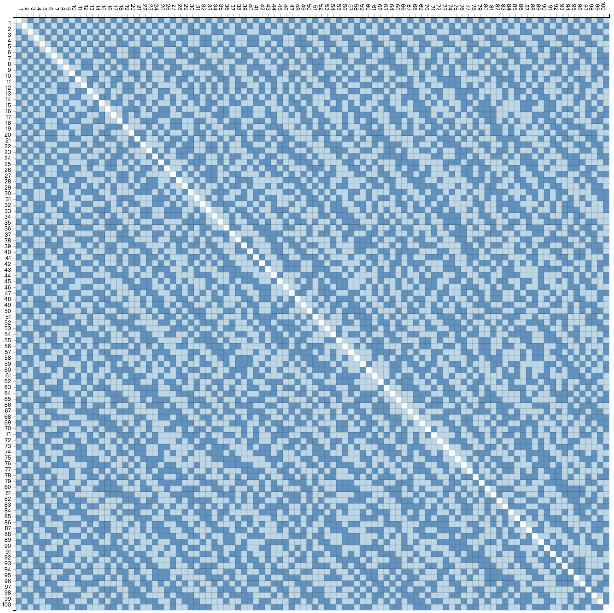
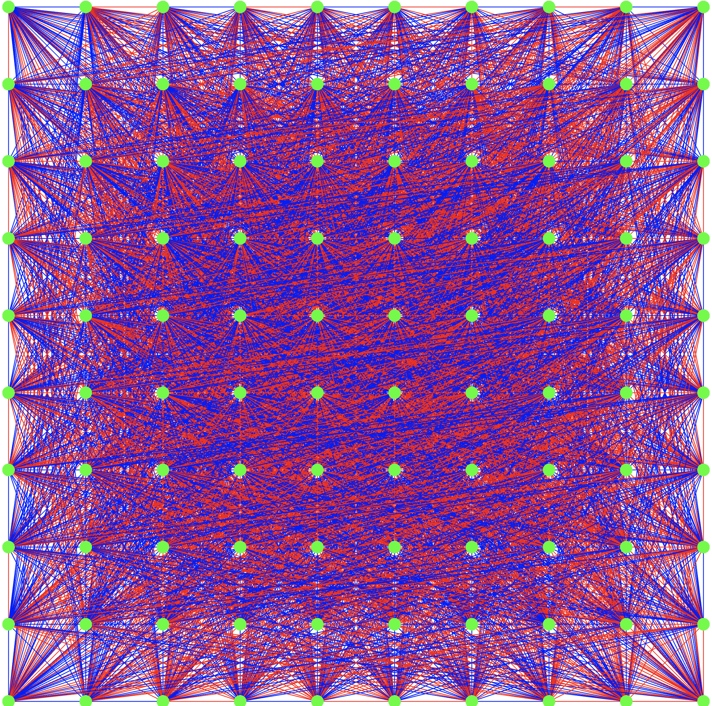

# Kn Coloring

## Theorem
> There is a two-coloring of Kn with at most  monochromatic K4.

## Run
```bash
gcc -o color color.c -O3 -std=c99 && ./color
```

## Output
```bash
Complete! Time used: 0.065205s
Monochromatic K4: 106845
Total K4:3921225, White:52703, Black:54142
```

## Visualization
### Adjacency Matrix

### Graph

